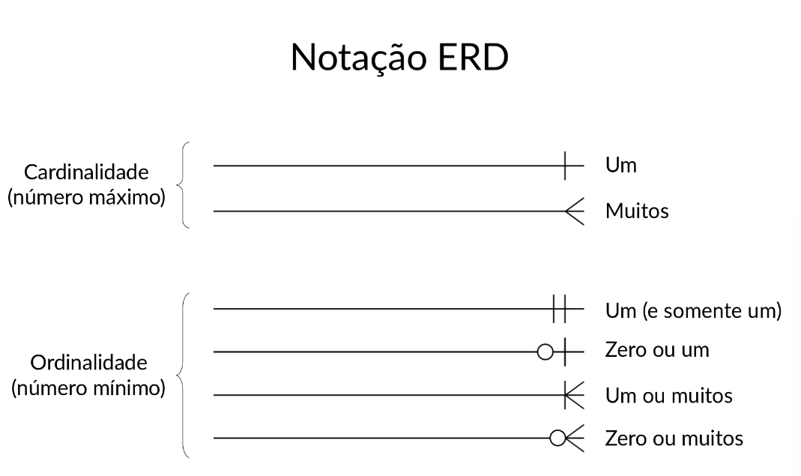
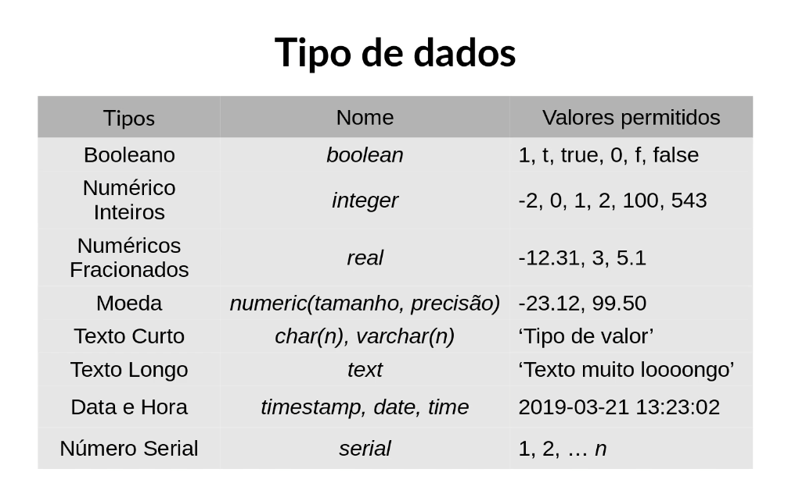
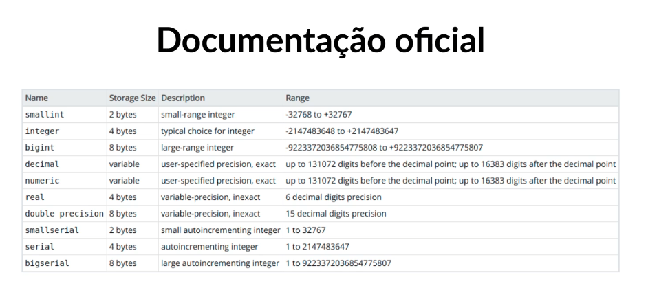

# Anotações

## Introdução ao PostgreSQL
- PostgreSQL é um sistema de gerenciamento de banco de dados relacional (SGBDR)

- Criando banco de dados(TODO CODIGO SQL VAI FICAR NO ARQUIVO SQL)

> Relacionamento:
> * 1..1 - Um para um
> * 1..N - Um para muitos
> * N..N - Muitos para muitos
> * 0..1 - Zero ou um
> * 0..N - Zero ou muitos

## Cardinalidade 

* Diagrama é importante para entender o relacionamento entre tabelas
* (Atributos | Nome da tabela | Tipo de dados)

> Tipos de dados:

> - moeda = decimal(10,2)
> - data = date
> - data e hora = timestamp
> - texto = varchar(255) ou text
> - número inteiro = integer
> - booleano = boolean
> - 
> - Documentação oficial do Postgres)(Tipos de dados)
> - 

* Truncar(truncate - se refere ao tamanho do atributo) é o erro mais comum em bancos de dados

> Atributos:
> * Chave primária(Primary Key - PK): Identificador único de cada registro na tabela.
> * Chave estrangeira(Foreign Key - FK): Atributo que cria um vínculo entre duas tabelas.
> * Not Null(NN): Restringe o atributo a não aceitar valores nulos.
> * Unique: Garante que todos os valores numa coluna sejam únicos.
> * Serial (AI): Tipo de dado especial que autoincrementa, geralmente usado para chaves primárias.
> * Default: Define um valor padrão para o atributo caso nenhum valor seja fornecido durante a inserção.

